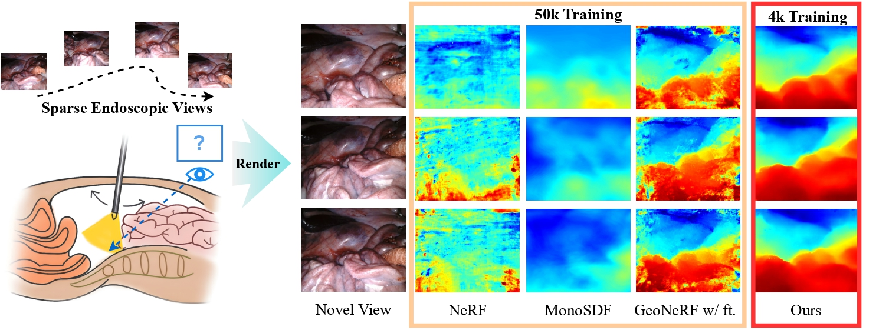
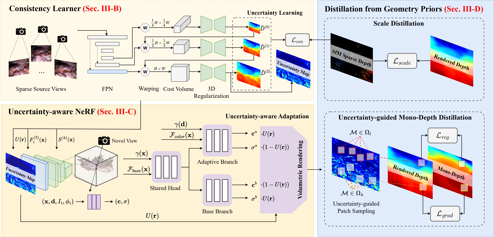

<p align="center">
  <h2 align="center">UC-NeRF: Uncertainty-Aware Conditional Neural Radiance Fields From Endoscopic Sparse Views</h2>
  <p align="center">
    <a href="https://wrld.github.io/"><strong>Jiaxin Guo</strong></a><sup>1</sup>&nbsp;&nbsp;&nbsp;
    <a href="https://laura-wang.github.io/"><strong>Jiangliu Wang</strong></a><sup>1</sup>&nbsp;&nbsp;&nbsp;
    <a href="https://tokuda-lab.bwh.harvard.edu/team/ruofeng-wei/"><strong>Ruofeng Wei</strong></a><sup>1</sup>&nbsp;&nbsp;&nbsp;
    <a href="https://scholar.google.com.hk/citations?user=2ztThPwAAAAJ&hl=zh-CN"><strong>Di Kang</strong></a><sup>2</sup>&nbsp;&nbsp;&nbsp;
    <a href="https://www.cse.cuhk.edu.hk/~qdou/"><strong>Qi Dou</strong></a><sup>1</sup>&nbsp;&nbsp;&nbsp;
    <a href="https://www4.mae.cuhk.edu.hk/peoples/liu-yun-hui/"><strong>Yun-hui Liu</strong></a><sup>1, 3</sup>&nbsp;&nbsp;&nbsp;
    <br />
    <sup>1</sup><strong>CUHK</strong>&nbsp;&nbsp;&nbsp; <sup>2</sup><strong>Tencent AI Lab</strong>&nbsp;&nbsp;&nbsp; <sup>3</sup><strong>HKCLR</strong>&nbsp;&nbsp;&nbsp; 
  </p>
</p>

The repository contains the official implementation for the **TMI 2024** paper [UC-NeRF: Uncertainty-Aware Conditional Neural Radiance Fields From Endoscopic Sparse Views](https://arxiv.org/abs/2409.02917). In this paper, we propose uncertainty-aware conditional NeRF for novel view synthesis to tackle the severe shape-radiance ambiguity from sparse surgical views. The core of UC-NeRF is to incorporate the multi-view uncertainty estimation to condition the neural radiance field for modeling the severe photometric inconsistencies adaptively.



## Installation
Install environment:
```
conda create -n ucnerf python=3.9
conda activate ucnerf
pip install torch==1.12.1+cu116 torchvision==0.13.1+cu116 torchaudio==0.12.1 --extra-index-url https://download.pytorch.org/whl/cu116
pip install -r requirements.txt
```
Our code is tested on Ubuntu 20.04 + CUDA 11.6 + Pytorch 1.12.1.
## Dataset Preprocessing
To reproduce the results, please download the preprocessed datasets of [SCARED](https://drive.google.com/drive/folders/1CfjptfeZLBK7rR2yqGly6MWN4zLpyXXf?usp=sharing) and [Hamlyn](https://drive.google.com/drive/folders/1oGGp667CC4bATsK8S296GNLRfDGTKFXp?usp=sharing) and unzip.

To test our method on your data, please follow the preprocessing as below:

- The dataset follows the directory structure as below:
```
├── data 
│   ├── scene01    
│   ├── ├── images
├── ├── scene02    
│   ├── ├── images     
```
- Run the COLMAP to obtain camera poses and sparse point cloud:
```
python preprocess/colmap/img2poses.py <your_scene_folder> 
```
- Run monocular depth model to obtain monocular depth as prior, we provide the script to use DPT following the paper implementation:
```
python preprocess/DPT/run_monodepth.py -i <your_scene_folder> 
```
You can find the generated monocular depth under `<your_scene_folder>/dpt/`.
## Evaluation
- Our pretrained model is included in the folder `pretrained_weights`. To reproduce the experiment result, please run the command for evaluation:
```
sh scripts/eval.sh
```
## Training
Please see each subsection for training on different datasets. Available training datasets:

* [SCARED](#scared)
* [Hamlyn](#hamlyn)

### SCARED
To obtain the dataset and code, please sign the challenge rules and email them to `max.allan@intusurg.com`.

To reproduce our result quickly, we provide the training samples from SCARED Dataset, please download [here](https://drive.google.com/drive/folders/1CfjptfeZLBK7rR2yqGly6MWN4zLpyXXf?usp=sharing) and unzip.
 
- To train the model, run the training script:

```
sh scripts/train_scared.sh
```

### Hamlyn
- Download the preprocessed [Hamlyn training samples](https://drive.google.com/drive/folders/1oGGp667CC4bATsK8S296GNLRfDGTKFXp?usp=sharing) and unzip.


- To train the model, run the training script:

```
sh scripts/train_hamlyn.sh
```

## Citing
If you find our work helpful, please cite:
```
@article{guo2024uc,
  title={UC-NeRF: Uncertainty-aware Conditional Neural Radiance Fields from Endoscopic Sparse Views},
  author={Guo, Jiaxin and Wang, Jiangliu and Wei, Ruofeng and Kang, Di and Dou, Qi and Liu, Yun-hui},
  journal={IEEE Transactions on Medical Imaging},
  year={2024},
  publisher={IEEE}
}
```